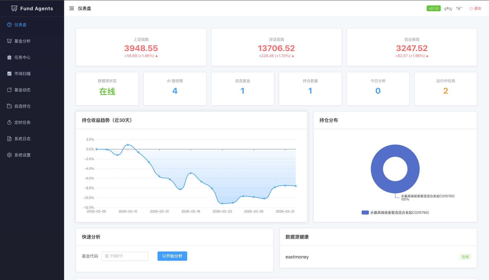
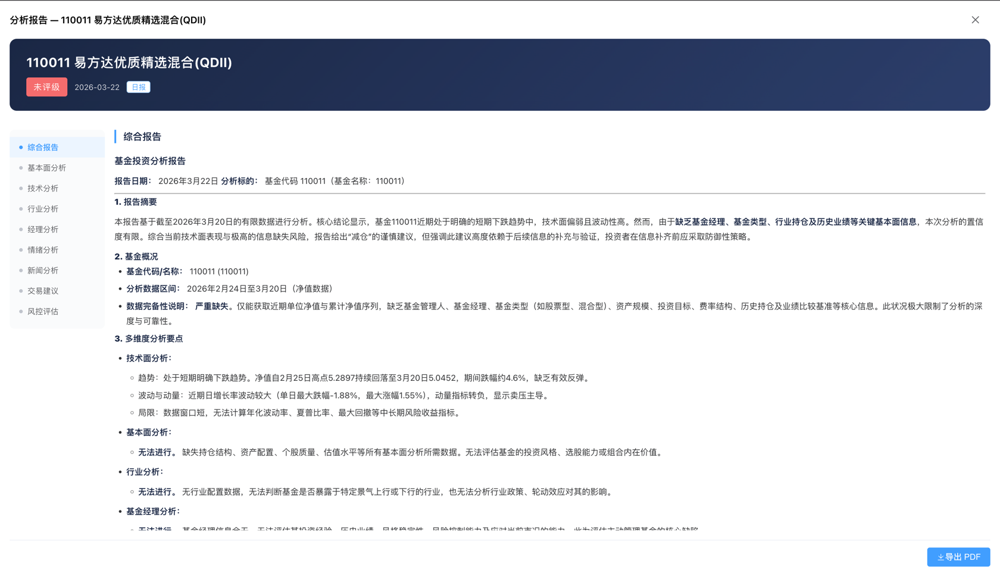

<h1 align="center">Fund Analysis Agents</h1>

<p align="center">
  <strong>基于多智能体协作的中国基金市场智能分析系统</strong>
</p>

<p align="center">
  <a href="#核心特性">核心特性</a> •
  <a href="#系统架构">系统架构</a> •
  <a href="#快速开始">快速开始</a> •
  <a href="#配置说明">配置说明</a> •
  <a href="#开发指南">开发指南</a> •
  <a href="#路线图">路线图</a>
</p>

<p align="center">
  
  
  
  
  
</p>

---

## 项目简介

Fund Analysis Agents 是一个面向中国公募基金市场的 AI 智能分析系统。通过多个专业化 AI
Agent（分析师、研究员、交易员、风控经理）协作，模拟真实投研团队的工作流程，为个人投资者提供**严谨、理性、可追溯**的基金投资分析与建议。

> **免责声明**：本系统生成的所有分析报告仅供参考，不构成投资建议。投资有风险，入市需谨慎。

<p align="center">
  
  <br/>
  <em>管理后台 — 自选基金、持仓管理、净值走势</em>
</p>

<p align="center">
  
  <br/>
  <em>Agent 分析流程 — 多智能体协作、辩论、决策全链路可视化</em>
</p>

## 核心特性

**多智能体协作分析**

- 6 个专业分析师 Agent 并行执行（基金、技术、行业、经理、情绪、新闻）
- 看多/看空研究员 3 轮结构化辩论，避免单一视角偏差
- 交易建议师 → 风控经理 → 组合顾问，逐层审核决策
- 基于 Spring AI Alibaba Graph 的 DAG 流程编排
- Agent 执行流程可视化，点击节点查看每个 Agent 的分析详情

**配置化管理后台**

- Vue 3 + Element Plus 响应式管理界面
- 自选基金、持仓管理、收益跟踪、净值走势图
- 多 LLM 模型配置（通义千问 / DeepSeek / OpenAI / 智谱），每个 Agent 可独立绑定模型
- 数据源动态配置与健康度监控
- 可视化定时任务管理（Cron 表达式）
- 系统架构实时状态图

**定时分析与智能推送**

- 盘中监控、盘后分析、每日/周/月报告
- 邮件（HTML 富文本）+ Bark 手机推送
- 中国交易日历适配，自动跳过非交易日

**证据可追溯**

- 每条结论标注证据层级：FACT（已披露事实）/ ESTIMATE（实时估算）/ INFERENCE（AI 推断）
- 完整的数据来源、采集时间、模型版本记录
- 分析批次管理，支持历史报告对比

**中国基金市场深度适配**

- 聚焦主动权益基金（股票型 + 偏股混合型）
- 基金经理变更预警、规模异动监控、限购状态跟踪
- 季报持仓变动分析、A/C 份额对比推荐
- 组合层风控规则（行业暴露、经理集中度、主题重复等）

**市场扫描与智能选基**

- 市场温度判断（危机/低迷/震荡/正常/过热），熊市自动抑制推荐
- 投资者适当性画像（风险等级、偏好行业、回撤容忍度等标签式配置）
- 量化初筛（规模、年限、业绩、回撤、夏普）+ 画像约束 + 交易可达性检查
- LLM 深度分析精选，结合现有持仓做组合适配，避免重复暴露
- A/C 份额自动推荐、申购费率展示、限购状态标注
- 时点快照留痕，每次推荐可完整复盘"为什么选了这几只"
- L1 数据不足时宁可不推荐，也不硬给名单

---

## 系统架构

```
┌─────────────────────────────────────────────────────────────┐
│  Presentation    Vue3 Admin │ REST API │ Bark/Email/Webhook │
│                  OpenClaw Plugin Interface (预留)            │
├─────────────────────────────────────────────────────────────┤
│  Application     Portfolio Mgmt │ Orchestrator │ Scheduler  │
├─────────────────────────────────────────────────────────────┤
│  Agent Layer     Analysts(6) → Bull/Bear Debate → Decision  │
│                  确定性因子引擎 + LLM 解释层                  │
├─────────────────────────────────────────────────────────────┤
│  Data Layer      天天基金 │ 东方财富 │ Tushare │ 新闻爬取    │
├─────────────────────────────────────────────────────────────┤
│  Infrastructure  MySQL │ Redis │ Docker │ Spring Boot 3.4   │
└─────────────────────────────────────────────────────────────┘
```

**Maven 多模块结构**

```
fund-analysis-agents/
├── fund-common           # 公共模块：工具类、枚举、异常、安全
├── fund-datasource       # 数据源：天天基金/东方财富/Tushare 适配器
├── fund-agent-core       # Agent 核心：多智能体、辩论、决策、图编排
├── fund-service          # 业务服务：分析编排、组合管理、通知、调度
├── fund-administration   # 管理后台：REST API + Vue 3 前端
└── fund-application      # 启动模块：Spring Boot Application
```

---

## 快速开始

### 环境要求

| 组件             | 版本要求   | 说明               |
|----------------|--------|------------------|
| Docker         | 20.10+ | 用于运行 MySQL、Redis |
| Docker Compose | v2+    | 中间件编排            |
| JDK            | 21     | 项目编译运行           |
| Maven          | 3.9+   | 项目构建             |
| Node.js        | 18+    | 前端构建（可选，脚本自动处理）  |

### 一键部署

> **不想折腾？** 如果你不熟悉 Java/Maven/Docker 环境配置，可以直接将本项目 clone 到本地，然后把这份 README 和 `scripts/` 目录下的脚本交给 AI（如 Claude、ChatGPT），让它帮你完成环境安装和项目启动。

我们提供了跨平台的一键部署脚本，自动完成以下全部流程：

```
环境检查 → .env 配置校验 → MySQL/Redis 启动 → 后端编译 → 前端构建 → 应用启动
```

**macOS / Linux：**

```bash
# 1. 克隆项目
git clone https://github.com/liuyocom/fund-analysis-agents.git
cd fund-analysis-agents

# 2. 配置 API Key（至少填写一个 LLM Key，推荐通义千问）
cp .env.example .env
vim .env    # 或用任意编辑器打开

# 3. 一键启动（自动完成环境检查、中间件启动、编译、运行）
chmod +x scripts/setup.sh
./scripts/setup.sh
```

**Windows：**

```powershell
# 1. 克隆项目
git clone https://github.com/liuyocom/fund-analysis-agents.git
cd fund-analysis-agents

# 2. 配置 API Key（至少填写一个 LLM Key，推荐通义千问）
copy .env.example .env
notepad .env

# 3. 一键启动
scripts\setup.bat
```

启动成功后：
- 管理后台：http://localhost:8080
- API 文档：http://localhost:8080/swagger-ui.html
- 默认账号：`admin` / `admin2026`

> 脚本会自动检测缺失的依赖并给出安装提示。如果没有安装 Node.js，前端构建会被跳过（不影响后端功能）。

---

## 配置说明

### .env 配置项

项目通过 `.env` 文件管理所有外部配置，复制 `.env.example` 后按需填写即可。

| 配置项 | 必填 | 说明 |
|-------|------|------|
| `DASHSCOPE_API_KEY` | 三选一 | 通义千问 API Key（推荐，性价比高） |
| `OPENAI_API_KEY` | 三选一 | OpenAI API Key |
| `DEEPSEEK_API_KEY` | 三选一 | DeepSeek API Key |
| `SMTP_HOST` / `SMTP_USERNAME` / `SMTP_PASSWORD` | 可选 | 邮件通知（SMTP） |
| `BARK_SERVER_URL` / `BARK_DEVICE_KEY` | 可选 | Bark 手机推送（iPhone） |
| `TUSHARE_API_TOKEN` | 可选 | Tushare 补充数据源 |
| `MYSQL_ROOT_PASSWORD` | 自动 | MySQL 密码，一键部署脚本自动配置 |
| `MYSQL_DATABASE` | 自动 | 数据库名，默认 `fund_analysis` |
| `SERVER_PORT` | 自动 | 应用端口，默认 `8080` |

> LLM API Key 至少配置一个，系统才能正常运行。推荐使用通义千问（DashScope），注册即送免费额度。

### API Key 获取指南

| 服务       | 获取地址                          | 说明                 |
|----------|-------------------------------|--------------------|
| 通义千问     | https://dashscope.aliyun.com  | 注册即送免费额度，推荐首选      |
| OpenAI   | https://platform.openai.com   | 需要海外支付方式           |
| DeepSeek | https://platform.deepseek.com | 国产模型，推理能力强         |
| Tushare  | https://tushare.pro           | 免费注册，基础接口够用        |
| Bark     | App Store 搜索 "Bark"           | 安装后自动获取 Device Key |

---

## 开发指南

### 本地开发

```bash
# 1. 启动中间件
docker compose up -d mysql redis

# 2. 复制并编辑配置
cp .env.example .env
# 编辑 .env，填写至少一个 LLM API Key

# 3. 加载环境变量
set -a && source .env && set +a

# 4. 编译项目（含前端构建）
cd fund-administration/src/main/webapp && npm install && npm run build && cd ../../../..
mvn clean package -DskipTests

# 5. 启动应用
java -jar fund-application/target/fund-application-0.0.1-SNAPSHOT.jar

# 6. 前端开发（热更新，可选）
cd fund-administration/src/main/webapp
npm run dev
# 前端开发服务器运行在 http://localhost:3000，自动代理 API 到 8080
```

> 手动启动时需要先 `source .env` 加载环境变量，一键部署脚本会自动处理。

### 默认账号

| 用户名 | 密码 | 角色 |
|-------|------|------|
| admin | admin2026 | 管理员 |

### 技术栈

- **后端**：Java 21 + Spring Boot 3.4 + Spring AI 1.0 + MyBatis Plus
- **前端**：Vue 3 + TypeScript + Vite + Element Plus + ECharts
- **存储**：MySQL 8.0 + Redis 7
- **AI**：Spring AI + Spring AI Alibaba（多模型支持）
- **部署**：Docker + Docker Compose

---

## 路线图

- [x] 技术设计与架构规划
- [x] **Phase 1**：基础框架 - 多模块骨架、数据源适配、数据库
- [x] **Phase 2**：Agent 系统 - 多智能体、辩论机制、决策链、图编排
- [x] **Phase 3**：管理后台 - Vue 3 前端、报告查看、Agent 执行流程可视化
- [x] **Phase 4**：定时任务与通知 - 调度系统、Bark/邮件推送、交易日历
- [ ] **Phase 5**：增强功能 - 基金对比、组合优化、更多数据源接入

---

## 参与贡献

欢迎提交 Issue 和 Pull Request。

1. Fork 本仓库
2. 创建特性分支 (`git checkout -b feature/amazing-feature`)
3. 提交更改 (`git commit -m 'feat: add amazing feature'`)
4. 推送到分支 (`git push origin feature/amazing-feature`)
5. 提交 Pull Request

---

## 致谢

- [TradingAgents](https://github.com/TauricResearch/TradingAgents) - 多智能体交易系统，本项目的灵感来源
- [Spring AI](https://spring.io/projects/spring-ai) - AI 框架
- [OpenClaw](https://clawd.org.cn) - 对话式交互能力（预留）

---

## License

Apache License 2.0
